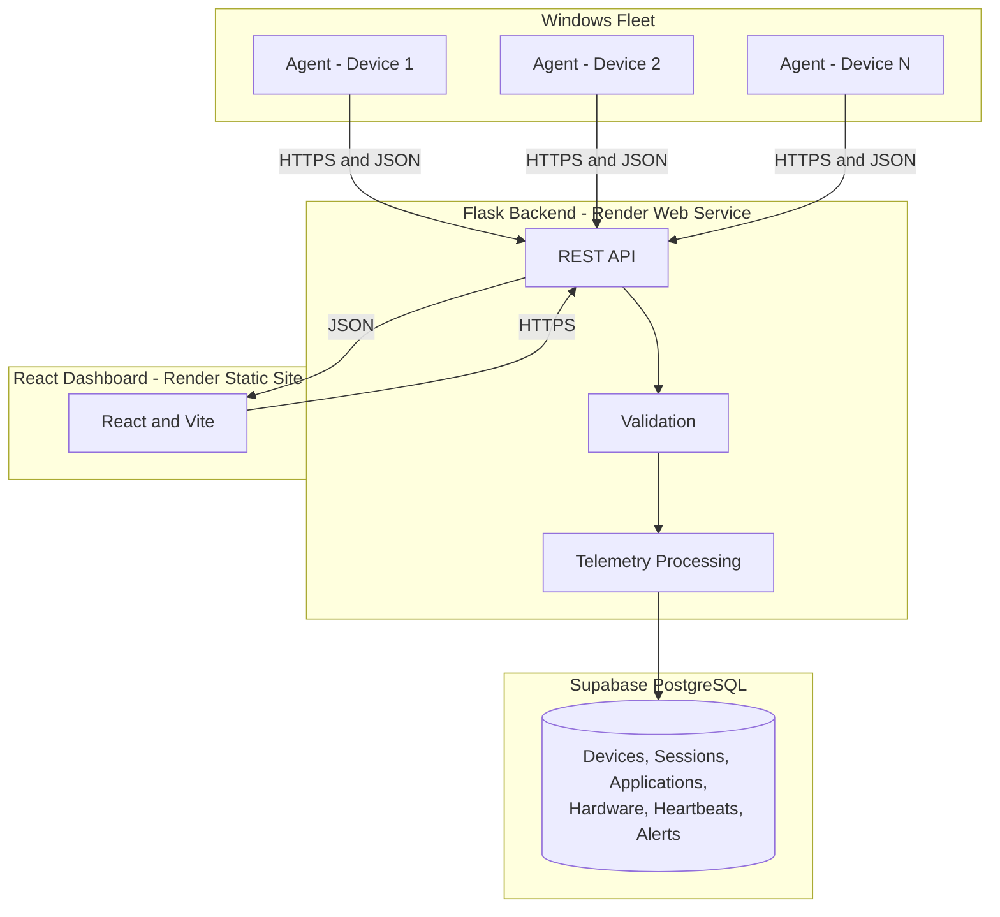

<div align="center">


### Continuous visibility from the endpoint to the fleet

Asset Sentinel turns Windows session, application, hardware, and heartbeat events into a live operational picture—so teams can act on what is true now, not what an inventory sheet remembered.

<br/>

<a href="https://assetsentinel.onrender.com/demo"></a>
<a href="https://github.com/Sarthaksulkhlan/Asset-Sentinel"></a>
<a href="LICENSE"></a>

**Website:** [https://assetsentinel.onrender.com](https://assetsentinel.onrender.com)

<br/><br/>

<a href="https://www.microsoft.com/windows"></a>
<a href="https://www.python.org/"></a>
<a href="https://flask.palletsprojects.com/"></a>
<a href="https://react.dev/"></a>
<a href="https://www.typescriptlang.org/"></a>
<a href="https://supabase.com/"></a>
<a href="https://render.com/"></a>

</div>

> **Production status:** Windows Agent → Flask API → Supabase PostgreSQL → React dashboard is deployed end to end. AI Audit remains intentionally unavailable until its backend endpoint is implemented.

## At a Glance

| | Description |
|---|---|
| **What it sees** | Device identity, hardware, users, login and unlock events, foreground applications, idle time, and heartbeat health. |
| **What it answers** | Which endpoints are alive, who is signed in, what is active, how time is distributed, and whether hardware state has changed. |
| **Why it is different** | Event-driven telemetry and explicit heartbeats replace periodic scans and manually maintained asset registers. |
| **Who it is for** | IT operations, endpoint security, support teams, and organization administrators responsible for Windows fleets. |
| **Trust boundary** | Agents and the dashboard communicate through one authenticated backend API; neither connects directly to the database or to each other. |
| **Production shape** | Windows agent + Flask/Gunicorn backend + Supabase PostgreSQL + React/Vite frontend, deployed through Render. |

> [Open the live demo](https://assetsentinel.onrender.com/demo) to explore Asset Sentinel with demonstration data.

## The Problem

Traditional asset registers and periodic inventory scans provide an outdated picture of a Windows fleet. They cannot reliably answer who is currently signed in, which application is active, whether a device is still online, or whether its hardware has changed since the last audit.

Asset Sentinel continuously captures session, application, hardware, and liveness events from managed endpoints. The dashboard reflects the fleet's current state instead of its last scheduled scan.

<div align="center">


<sub><em>Periodic inventory leaves hardware changes, missed heartbeats, and session activity hidden. Asset Sentinel turns those gaps into live, attributable signals.</em></sub>

</div>

## Why Asset Sentinel

| Traditional fleet visibility | Asset Sentinel |
|---|---|
| Inventory updated when someone runs a scan | Telemetry updated continuously from the endpoint |
| Online state inferred from an old record | Explicit heartbeat establishes current liveness |
| Hardware stored as a static specification | Hardware identity can be compared over time |
| Application usage reconstructed from assumptions | Foreground, active, idle, and locked time come from measured events |
| Monitoring, alerts, and support live in separate tools | The same telemetry supports dashboards, alerts, reports, and tickets |
| Fleet totals hide the evidence behind them | Operators can move from fleet overview to device-level activity |

## Key Features

| Category | Capability |
|---|---|
| Real-Time Telemetry | Continuous heartbeat stream from registered endpoints |
| Session Intelligence | Login, logout, lock, and unlock activity per device and user |
| Application Monitoring | Active-window detection and per-application usage duration |
| Productivity Analytics | Active, idle, locked, and productive time derived from telemetry |
| Hardware Inventory | Hardware cataloging and change detection |
| Device Monitoring | Online/offline state and detailed endpoint information |
| Alerts and Reports | Fleet and device-level conditions presented for review |
| Support Tickets | Ticketing connected to organization and device context |
| Super Admin | Platform-level company and fleet administration |

## From Endpoint Evidence to Fleet Intelligence

<div align="center">


<sub><em>Session, application, hardware, and heartbeat evidence is authenticated and normalized before it becomes fleet health, timelines, usage insight, and actionable integrity alerts.</em></sub>

</div>

## System Architecture



The agent never connects directly to the database, and the dashboard never connects directly to monitored devices. Telemetry passes through the backend API for authentication, validation, processing, and persistence.

## How It Works

1. The Windows agent runs continuously on each managed endpoint.
2. It detects session state, foreground applications, hardware information, and device health.
3. Timestamped telemetry is sent securely to the backend API.
4. The backend validates and stores records in Supabase PostgreSQL.
5. The React dashboard retrieves current and aggregated fleet information from the API.


## Technology Stack

| Layer | Technology |
|---|---|
| Windows Agent | Python and Windows Service APIs |
| Backend API | Python and Flask |
| Database | Supabase PostgreSQL |
| Frontend | React, TypeScript, and Vite |
| Frontend Hosting | Render Static Site |
| Backend Hosting | Render Web Service and Gunicorn |
| Transport | HTTPS and JSON |

## Repository Structure

```text
asset-sentinel/
├── agent/
│   ├── collectors/       Session, heartbeat, hardware, and application collectors
│   ├── detectors/        Hardware change detectors
│   ├── scripts/          Agent and service management scripts
│   └── windows/          Windows Service implementation
├── backend/
│   ├── api/              Flask API routes
│   ├── core/             Configuration, database, storage, and health
│   ├── models/           SQLAlchemy models
│   └── services/         Backend services
├── database/
│   ├── migrations/       Database migrations
│   └── schemas/          PostgreSQL schema
├── frontend/             React and Vite dashboard
├── docs/                 Architecture, setup, and installation documentation
├── tools/                Migration and verification utilities
├── app.py                Backend launcher and Gunicorn application export
└── requirements.txt      Python dependencies
```

## Dashboard Modules

- Real-Time Fleet Telemetry
- Device Monitoring
- Productivity Analytics
- Login Activity
- Active Application Timeline
- Application Usage
- Hardware and security alerts
- Reports
- Support Tickets
- Super Admin Dashboard

## Windows Monitoring Agent

The agent runs on monitored Windows endpoints and reports:

| Data | Description |
|---|---|
| Login Activity | Genuine Windows login and unlock events |
| Logout Activity | Logout, lock, and disconnect transitions |
| Active Applications | Current foreground application |
| Application Usage | Time spent in monitored applications |
| Productivity | Active, idle, and locked time |
| Hardware Inventory | Device specifications and identifiers |
| Heartbeat | Periodic device liveness signal |
| Device Information | Host, user, network, and operating-system metadata |

## Environment Setup

Copy `.env.example` to `.env` for local development and configure the required values. Production secrets must be set through Render environment variables and must never be committed.

Install backend dependencies:

```powershell
pip install -r requirements.txt
```

## Run Locally

Backend:

```powershell
python app.py
```

Frontend:

```powershell
cd frontend
npm install
npm run dev
```

Manual Windows agent:

```powershell
python agent/collectors/monitoring_agent.py --console
```

## Windows Service

Run the installation command from an elevated Windows Command Prompt or PowerShell:

```bat
install_service.bat
```

Service controls:

```bat
start_service.bat
stop_service.bat
restart_service.bat
uninstall_service.bat
```

## Render Deployment

Backend Web Service:

```text
Root Directory: leave blank
Build Command: pip install -r requirements.txt
Start Command: python -m backend.render_start && gunicorn --bind 0.0.0.0:$PORT --workers 1 app:app
```

Frontend Static Site:

```text
Root Directory: frontend
Build Command: npm ci && npm run build
Publish Directory: dist
```

React routes require this Render rewrite rule:

```text
Source: /*
Destination: /index.html
Action: Rewrite
```

## Security

- Agent-to-backend and frontend-to-backend traffic uses HTTPS in production.
- Secrets are supplied through environment variables.
- Agent telemetry requests are authenticated.
- Dashboard access is protected by authentication and role checks.
- Administrative functions are restricted to appropriate roles.

## Current Limitations

| Feature | Status |
|---|---|
| AI Audit | Coming soon; its backend endpoint is not currently implemented |
| Monitoring modules | Operational |

## Roadmap

- [ ] Implement the AI Audit backend endpoint
- [ ] Expand automated report exports
- [ ] Add more granular role-based permissions
- [ ] Publish formal OpenAPI documentation
- [ ] Add configurable historical data-retention policies

## Documentation

- [Architecture](docs/ARCHITECTURE.md)
- [Installation](docs/INSTALLATION.md)
- [Setup](docs/SETUP.md)
- [Screenshot guidance](docs/screenshots/README.md)
