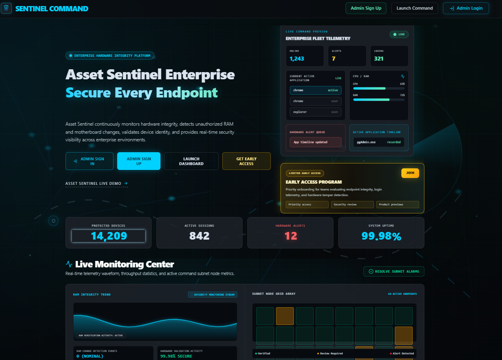
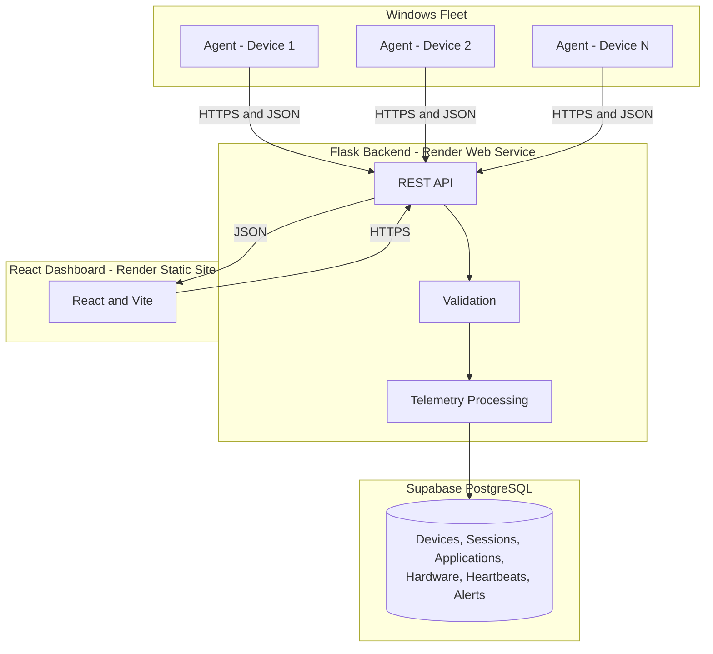
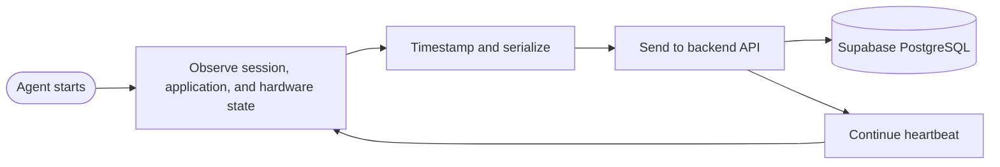

<div align="center">


# The Endpoint Truth Layer for Windows Fleets

**Real-time endpoint telemetry, session intelligence, hardware integrity, and application visibility for Windows fleets.**

Most IT teams do not know what is happening on their machines right now—they know what a spreadsheet said last quarter. Asset Sentinel replaces the snapshot with a heartbeat.

<br/>

<a href="https://assetsentinel.onrender.com/demo"></a>
<a href="LICENSE"></a>
<a href="https://assetsentinel.onrender.com"></a>

</div>

> **Status: Production.** The agent, backend, dashboard, and documented monitoring modules are live and operational. AI Audit is intentionally unavailable until its backend endpoint is implemented.

<div align="center">



<sub><em>The live product landing page with fleet telemetry, protected-device statistics, and system uptime.</em></sub>

</div>

## At a Glance

| | Description |
|---|---|
| **What** | A continuously updated source of truth for Windows endpoints: users, applications, hardware, sessions, and availability. |
| **Why it is different** | Persistent agent telemetry and heartbeat data replace scheduled inventory snapshots. |
| **Who it is for** | IT administrators, security teams, and organization leaders who need fleet-wide visibility. |
| **Current status** | Production deployment with the Windows agent, Flask backend, React dashboard, Render, and Supabase connected end to end. |

> [Open the live demo](https://assetsentinel.onrender.com/demo) to explore the product with demonstration data, or [open the production website](https://assetsentinel.onrender.com).

## The Problem

Traditional asset registers and periodic inventory scans provide an outdated picture of a Windows fleet. They cannot reliably answer who is currently signed in, which application is active, whether a device is still online, or whether its hardware has changed since the last audit.

Asset Sentinel continuously captures session, application, hardware, and liveness events from managed endpoints. The dashboard reflects the fleet's current state instead of its last scheduled scan.

## Key Features

| Category | Capability |
|---|---|
| Real-Time Telemetry | Continuous heartbeat stream from registered endpoints |
| Session Intelligence | Login, logout, lock, and unlock activity per device and user |
| Application Monitoring | Active-window detection and per-application usage duration |
| Productivity Analytics | Active, idle, locked, and productive time derived from telemetry |
| Hardware Inventory | Hardware cataloging and change detection |
| Device Monitoring | Online/offline state and detailed endpoint information |
| Alerts and Reports | Fleet and device-level conditions presented for review |
| Support Tickets | Ticketing connected to organization and device context |
| Super Admin | Platform-level company and fleet administration |

## System Overview

<div align="center">


<sub><em>Fleet-wide telemetry with online and offline devices, live status, and the activity stream.</em></sub>

</div>

## System Architecture



The agent never connects directly to the database, and the dashboard never connects directly to monitored devices. Telemetry passes through the backend API for authentication, validation, processing, and persistence.

## How It Works

1. The Windows agent runs continuously on each managed endpoint.
2. It detects session state, foreground applications, hardware information, and device health.
3. Timestamped telemetry is sent securely to the backend API.
4. The backend validates and stores records in Supabase PostgreSQL.
5. The React dashboard retrieves current and aggregated fleet information from the API.



## Technology Stack

| Layer | Technology |
|---|---|
| Windows Agent | Python and Windows Service APIs |
| Backend API | Python and Flask |
| Database | Supabase PostgreSQL |
| Frontend | React, TypeScript, and Vite |
| Frontend Hosting | Render Static Site |
| Backend Hosting | Render Web Service and Gunicorn |
| Transport | HTTPS and JSON |

## Repository Structure

```text
asset-sentinel/
├── agent/
│   ├── collectors/       Session, heartbeat, hardware, and application collectors
│   ├── detectors/        Hardware change detectors
│   ├── scripts/          Agent and service management scripts
│   └── windows/          Windows Service implementation
├── backend/
│   ├── api/              Flask API routes
│   ├── core/             Configuration, database, storage, and health
│   ├── models/           SQLAlchemy models
│   └── services/         Backend services
├── database/
│   ├── migrations/       Database migrations
│   └── schemas/          PostgreSQL schema
├── frontend/             React and Vite dashboard
├── docs/                 Architecture, setup, and installation documentation
├── tools/                Migration and verification utilities
├── app.py                Backend launcher and Gunicorn application export
└── requirements.txt      Python dependencies
```

## Dashboard Modules

- Real-Time Fleet Telemetry
- Device Monitoring
- Productivity Analytics
- Login Activity
- Active Application Timeline
- Application Usage
- Hardware and security alerts
- Reports
- Support Tickets
- Super Admin Dashboard

## Windows Monitoring Agent

The agent runs on monitored Windows endpoints and reports:

| Data | Description |
|---|---|
| Login Activity | Genuine Windows login and unlock events |
| Logout Activity | Logout, lock, and disconnect transitions |
| Active Applications | Current foreground application |
| Application Usage | Time spent in monitored applications |
| Productivity | Active, idle, and locked time |
| Hardware Inventory | Device specifications and identifiers |
| Heartbeat | Periodic device liveness signal |
| Device Information | Host, user, network, and operating-system metadata |

## Environment Setup

Copy `.env.example` to `.env` for local development and configure the required values. Production secrets must be set through Render environment variables and must never be committed.

Install backend dependencies:

```powershell
pip install -r requirements.txt
```

## Run Locally

Backend:

```powershell
python app.py
```

Frontend:

```powershell
cd frontend
npm install
npm run dev
```

Manual Windows agent:

```powershell
python agent/collectors/monitoring_agent.py --console
```

## Windows Service

Run the installation command from an elevated Windows Command Prompt or PowerShell:

```bat
install_service.bat
```

Service controls:

```bat
start_service.bat
stop_service.bat
restart_service.bat
uninstall_service.bat
```

## Render Deployment

Backend Web Service:

```text
Root Directory: leave blank
Build Command: pip install -r requirements.txt
Start Command: python -m backend.render_start && gunicorn --bind 0.0.0.0:$PORT --workers 1 app:app
```

Frontend Static Site:

```text
Root Directory: frontend
Build Command: npm ci && npm run build
Publish Directory: dist
```

React routes require this Render rewrite rule:

```text
Source: /*
Destination: /index.html
Action: Rewrite
```

## Security

- Agent-to-backend and frontend-to-backend traffic uses HTTPS in production.
- Secrets are supplied through environment variables.
- Agent telemetry requests are authenticated.
- Dashboard access is protected by authentication and role checks.
- Administrative functions are restricted to appropriate roles.

## Current Limitations

| Feature | Status |
|---|---|
| AI Audit | Coming soon; its backend endpoint is not currently implemented |
| Monitoring modules | Operational |

## Roadmap

- [ ] Implement the AI Audit backend endpoint
- [ ] Expand automated report exports
- [ ] Add more granular role-based permissions
- [ ] Publish formal OpenAPI documentation
- [ ] Add configurable historical data-retention policies

## Documentation

- [Architecture](docs/ARCHITECTURE.md)
- [Installation](docs/INSTALLATION.md)
- [Setup](docs/SETUP.md)
- [Screenshot guidance](docs/screenshots/README.md)
