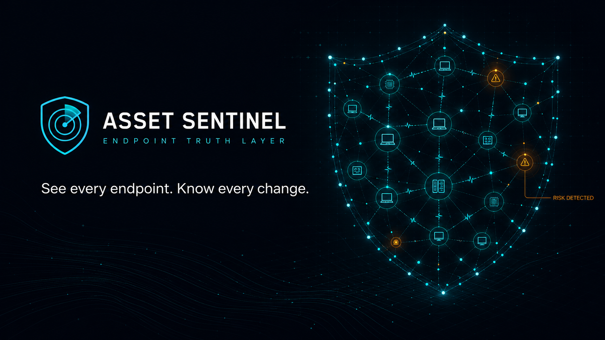
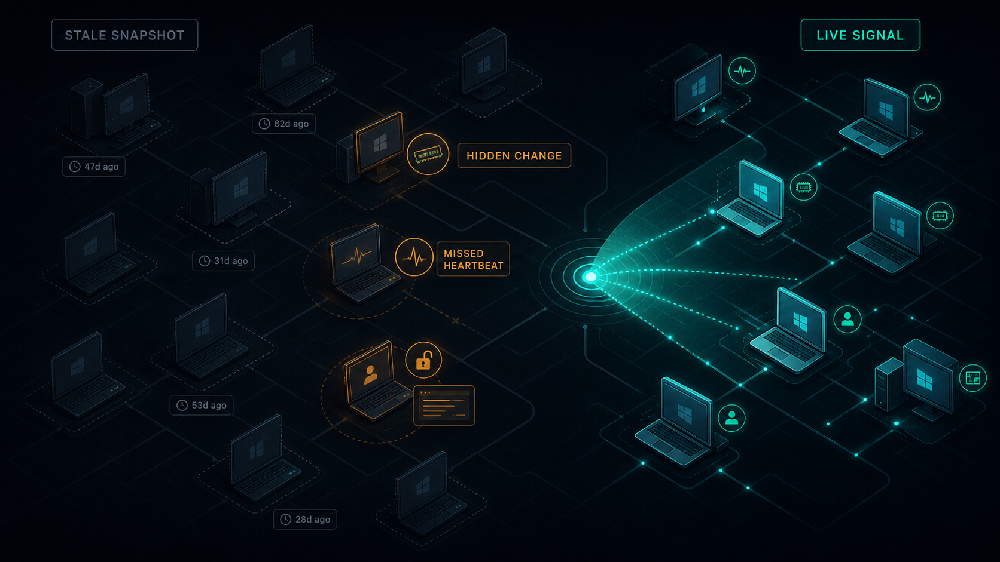
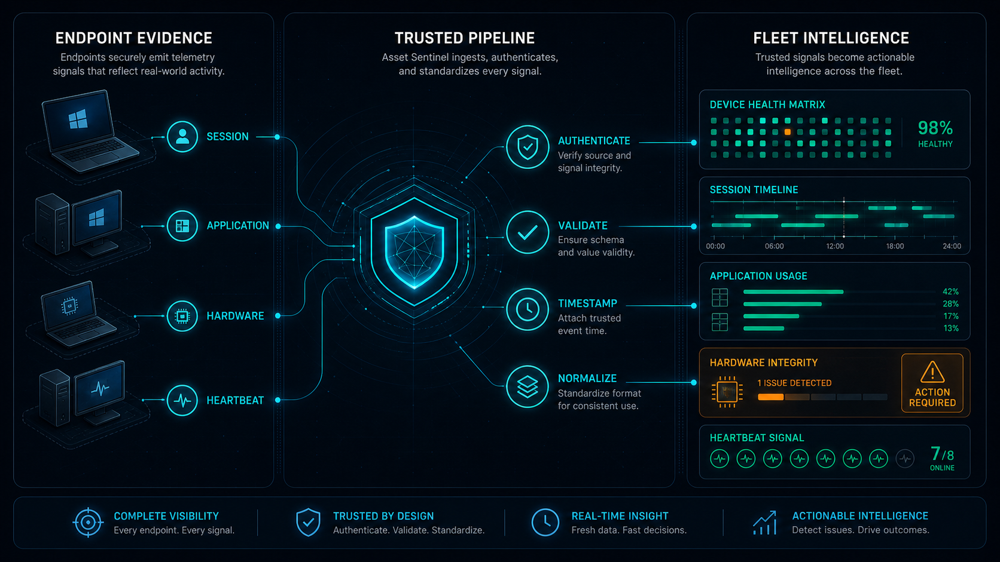
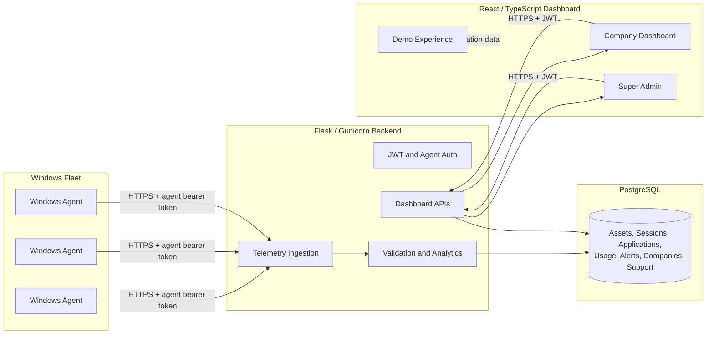
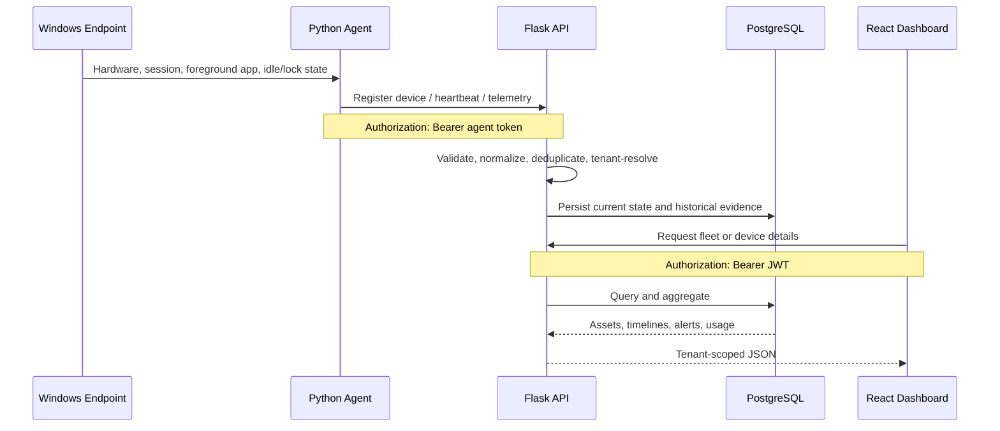
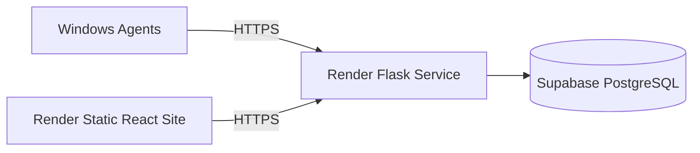

<div align="center">



# Asset Sentinel

### Continuous Windows endpoint visibility—from device evidence to fleet intelligence

Asset Sentinel converts Windows hardware, session, application, activity, and heartbeat telemetry into a live, tenant-aware operational view for IT and security teams.

<br/>

<a href="https://assetsentinel.onrender.com/demo"></a>
<a href="https://github.com/Sarthaksulkhlan/Asset-Sentinel"></a>
<a href="LICENSE"></a>

<br/><br/>


**Live site:** [assetsentinel.onrender.com](https://assetsentinel.onrender.com) · **Demo:** [assetsentinel.onrender.com/demo](https://assetsentinel.onrender.com/demo)

</div>

> [!NOTE]
> The deployed core path is **Windows Agent → Flask API → PostgreSQL → React dashboard**. An experimental Gemini audit route exists in the optional Express runtime, but it is not exposed by the current static Render frontend deployment. See [Feature status](#feature-status-and-known-limitations).

## Table of contents

- [Why Asset Sentinel](#why-asset-sentinel)
- [Capabilities](#capabilities)
- [Architecture](#architecture)
- [How telemetry becomes intelligence](#how-telemetry-becomes-intelligence)
- [Technology stack](#technology-stack)
- [Repository structure](#repository-structure)
- [Quick start](#quick-start)
- [Configuration](#configuration)
- [API overview](#api-overview)
- [Windows agent](#windows-agent)
- [Security model](#security-model)
- [Deployment](#deployment)
- [Feature status and known limitations](#feature-status-and-known-limitations)
- [Documentation](#documentation)

## Why Asset Sentinel

Traditional inventory tools describe a device at scan time. Asset Sentinel builds a continuous evidence trail of what happened between scans: when a device was last alive, which user session was active, which foreground application was observed, whether the workstation was idle or locked, and whether important hardware identity changed.

| Traditional fleet visibility | Asset Sentinel |
|---|---|
| Periodic inventory snapshots | Continuous authenticated telemetry |
| Availability inferred from stale data | Heartbeat-derived online/offline state |
| Hardware changes discovered later | RAM and motherboard baseline comparison |
| Session events isolated in Windows logs | Centralized login, logout, lock, and unlock history |
| Application activity stored separately | Per-device application timeline and usage aggregation |
| Fleet totals without supporting context | Drill-down from fleet KPIs to device evidence |
| Disconnected support workflow | Tenant-aware support tickets alongside device context |

<div align="center">



<sub><em>Continuous telemetry turns missed heartbeats, session transitions, application activity, and hardware changes into attributable operational evidence.</em></sub>

</div>

## Capabilities

| Domain | Implemented capability |
|---|---|
| **Endpoint inventory** | Hostname, IP/MAC address, Windows version, CPU, RAM, BIOS, baseboard, UUID, and stable device identity |
| **Liveness** | Configurable heartbeat with current CPU/RAM usage and freshness-based status |
| **Session evidence** | Windows-backed login, logout, lock, unlock, user, session ID, IP, and duration records |
| **Application visibility** | Foreground application, executable, window title, process path, and chronological history |
| **Activity analytics** | Active, idle, and locked intervals; application usage summaries; productivity metrics |
| **Hardware integrity** | RAM and motherboard change detection with before/after evidence and alert linkage |
| **Fleet operations** | KPIs, asset list, alert review, device details, timelines, charts, and periodic refresh |
| **Multi-tenancy** | Company-scoped assets, users, telemetry, and support data |
| **Administration** | Company registration, JWT authentication, password-reset OTP, company status, and super-admin command center |
| **Support** | Ticket creation, prioritization, status/response workflow, related-device context, and SMTP messages |

<div align="center">



<sub><em>Endpoint evidence is authenticated, normalized, persisted, and transformed into fleet state, timelines, usage insights, and integrity alerts.</em></sub>

</div>

## Architecture



### Trust boundaries

- Agents never connect directly to PostgreSQL.
- The dashboard never connects directly to monitored endpoints.
- Agent ingestion and browser access use different credentials.
- Company users receive data scoped to their `company_id`; `SUPER_ADMIN` is explicitly authorized for cross-tenant operations.
- PostgreSQL is the source of truth. Files under `database/data/` are migration or validation artifacts, not the production datastore.

### Runtime topology

The repository supports two frontend arrangements:

1. **Current Render topology:** Vite builds a static React application that calls the Flask service through `VITE_API_BASE_URL`.
2. **Optional Express topology:** `frontend/server.ts` hosts Vite/static assets, proxies selected `/api/*` requests to Flask, supplies limited read-only fallback data, and contains the experimental `/api/audit-asset` route.

The checked-in `render.yaml` deploys the first arrangement. Therefore, Express-only behavior is not available on the current static frontend service.

## How telemetry becomes intelligence



### Core flows

1. **Device registration:** the agent collects stable hardware identifiers, resolves a device UID, and posts a baseline to `/api/agent/register`.
2. **Liveness:** heartbeats update `last_seen`, CPU/RAM usage, and the latest application. The backend derives device status from freshness.
3. **Sessions:** native Windows evidence creates or closes sessions. Heartbeats and application changes do not fabricate login events.
4. **Applications:** foreground transitions create timeline records; consecutive samples become active, idle, or locked usage intervals.
5. **Integrity:** new hardware snapshots are compared with the baseline. RAM or motherboard differences create auditable change records and alerts.
6. **Dashboard:** authenticated APIs return fleet state and assembled device detail, including sessions, alerts, application history, hardware changes, timelines, and chart data.

> [!IMPORTANT]
> Session and activity records are endpoint evidence—not an HR attendance system. The repository does not implement shifts, leave, approval, payroll, geofencing, facial recognition, or attendance status.

## Technology stack

| Layer | Technology | Responsibility |
|---|---|---|
| Windows agent | Python, `requests`, `psutil`, pywin32, WMI | Collection, local orchestration, retry/spooling, and telemetry transport |
| Backend API | Python, Flask, Flask-CORS, Gunicorn | REST endpoints, validation, authorization, tenant scope, and analytics |
| Data access | SQLAlchemy 2, psycopg2 | ORM models, transactions, constraints, indexes, and PostgreSQL access |
| Authentication | PyJWT, bcrypt | Access/refresh tokens, password hashing, role enforcement, and OTP reset |
| Database | PostgreSQL / Supabase | Operational and historical source of truth |
| Frontend | React 19, TypeScript 5.8, Vite 6 | SPA routing, authentication state, dashboard, forms, and visualizations |
| UI | Tailwind CSS 4, Lucide React, Motion | Responsive styling, icons, and animation |
| Optional web server | Express 4, tsx, esbuild | Same-origin proxy, local/full-stack hosting, and experimental AI route |
| Optional AI | Google Gen AI SDK | Structured asset audit in the Express-only experimental path |
| Hosting | Render | Static frontend and Python web service |

## Repository structure

```text
Asset-Sentinel/
├── agent/
│   ├── client/              # Authenticated API client and usage buffering
│   ├── collectors/          # Hardware, heartbeat, session, and application collectors
│   ├── detectors/           # RAM and motherboard change detection
│   ├── scripts/             # Windows service lifecycle helpers
│   └── windows/             # Windows Service host and PyInstaller specification
├── backend/
│   ├── api/                 # Browser, administration, support, and agent APIs
│   ├── core/                # Config, database, storage, security, health, and logging
│   ├── models/              # SQLAlchemy models and constraints
│   ├── services/            # Notification and telemetry services
│   └── main.py              # Flask application and runtime initialization
├── database/
│   ├── migrations/          # Incremental PostgreSQL migrations
│   ├── schemas/             # Base schema
│   └── data/                # Migration/validation artifacts
├── frontend/
│   ├── src/                 # React screens, auth context, API client, and types
│   └── server.ts            # Optional Express host/proxy
├── docs/                    # Architecture, setup, installation, and screenshots
├── tools/verification/      # Integrity, migration, and live-cycle checks
├── app.py                   # Compatibility launcher and Gunicorn app export
├── render.yaml              # Render static frontend + Python backend deployment
└── requirements.txt         # Python dependencies
```

## Quick start

### Prerequisites

- Python 3.10 or newer
- Node.js 20 or newer and npm
- PostgreSQL database
- Windows for endpoint collectors and Windows Service functionality

### 1. Configure the environment

```powershell
Copy-Item .env.example .env
```

At minimum, configure a PostgreSQL URL, JWT secret, and agent token. Never commit `.env` or production credentials.

### 2. Install backend dependencies

```powershell
python -m pip install -r requirements.txt
```

### 3. Prepare PostgreSQL

Apply the base schema and required migrations using your PostgreSQL administration workflow. See [docs/SETUP.md](docs/SETUP.md) for the current order.

### 4. Start the backend

```powershell
python app.py
```

The local Flask API defaults to `http://127.0.0.1:5000`.

### 5. Start the frontend

Open a second terminal:

```powershell
Set-Location frontend
npm install
npm run dev
```

`npm run dev` starts the optional Express/Vite development server. For a static Vite build, ensure `VITE_API_BASE_URL` points to the Flask origin.

### 6. Run an agent interactively

On a monitored Windows machine:

```powershell
python agent/collectors/monitoring_agent.py --console
```

The machine must have `ASSET_SENTINEL_API_URL` and the same `ASSET_SENTINEL_AGENT_TOKEN` configured as the backend.

## Configuration

| Variable | Required by | Purpose |
|---|---|---|
| `ASSET_SENTINEL_DATABASE_URL` | Backend | PostgreSQL connection string |
| `ASSET_SENTINEL_JWT_SECRET` | Backend | Signs and validates user JWTs |
| `ASSET_SENTINEL_AGENT_TOKEN` | Backend + agent | Shared bearer token for agent telemetry |
| `ASSET_SENTINEL_API_URL` | Agent | Flask API origin, without a trailing endpoint path |
| `VITE_API_BASE_URL` | Static frontend | Flask API origin used by browser requests |
| `ASSET_SENTINEL_CORS_ORIGINS` | Backend | Comma-separated allowed frontend origins |
| `SUPER_ADMIN_USERNAME` | Backend bootstrap | Initial platform administrator username |
| `SUPER_ADMIN_EMAIL` | Backend bootstrap | Initial platform administrator email |
| `SUPER_ADMIN_PASSWORD` | Backend bootstrap | Initial platform administrator password |
| `SMTP_HOST`, `SMTP_PORT` | Backend notifications | SMTP server and port |
| `SMTP_USERNAME`, `SMTP_PASSWORD` | Backend notifications | SMTP credentials |
| `SMTP_FROM_EMAIL`, `ALERT_EMAIL` | Backend notifications | Sender and alert destination |
| `GEMINI_API_KEY` | Optional Express runtime | Enables the experimental AI asset audit |

Additional collector intervals, retry limits, spool limits, and SMTP settings are documented in [.env.example](.env.example).

> [!CAUTION]
> The source includes a development fallback agent token for local convenience. Always set a strong, unique `ASSET_SENTINEL_AGENT_TOKEN` in every non-development environment.

## API overview

All primary APIs exchange JSON. Browser endpoints use JWT bearer authentication; `/api/agent/*` endpoints use the separate agent token.

### Authentication and registration

| Method | Endpoint | Purpose |
|---|---|---|
| `POST` | `/api/auth/login` | Authenticate and issue access/refresh tokens |
| `POST` | `/api/auth/refresh` | Exchange a valid refresh token for a new access token |
| `POST` | `/api/auth/logout` | Revoke a refresh token |
| `GET` | `/api/auth/me` | Return the authenticated user |
| `POST` | `/api/auth/forgot-password` | Create and send a password-reset OTP |
| `POST` | `/api/auth/verify-reset-code` | Verify a reset OTP |
| `POST` | `/api/auth/reset-password` | Reset password and revoke existing refresh tokens |
| `POST` | `/api/early-access` | Store an early-access request |
| `POST` | `/api/admin-signup` | Create a company workspace and company administrator |

### Fleet and analytics

| Method | Endpoint | Purpose |
|---|---|---|
| `GET` | `/api/assets` | Tenant-scoped fleet snapshot |
| `GET` | `/api/assets/{identifier}/details` | Complete device detail, history, alerts, and charts |
| `GET` | `/api/alerts` | Tenant-scoped alert records |
| `GET` | `/api/active-applications` | Latest foreground application per host |
| `GET` | `/api/active-application-history/{identifier}` | Lightweight recent application timeline |
| `GET` | `/api/sessions` | Session-event history |
| `GET` | `/api/sessions/count` | Login/logout event totals |

### Support and platform administration

| Method | Endpoint | Purpose |
|---|---|---|
| `GET`, `POST` | `/api/support/tickets` | List or create tenant support tickets |
| `PATCH` | `/api/support/tickets/{id}` | Update a ticket as super administrator |
| `POST` | `/api/support/email` | Send a support message through SMTP |
| `GET` | `/api/super-admin/overview` | Platform-wide summary |
| `GET` | `/api/super-admin/companies` | Company management list |
| `GET`, `PATCH` | `/api/super-admin/company/{id}` | Read or activate/suspend a company |
| `GET` | `/api/super-admin/tickets` | Platform-wide support queue |

### Agent ingestion

| Method | Endpoint | Purpose |
|---|---|---|
| `POST` | `/api/agent/register` | Register/update hardware baseline and detect changes |
| `POST` | `/api/agent/heartbeat` | Update liveness, utilization, and current application |
| `POST` | `/api/agent/session` | Record a Windows session event |
| `POST` | `/api/agent/application` | Record an application/activity observation |
| `POST` | `/api/agent/application-event` | Record an application transition |
| `POST` | `/api/agent/activity-usage` | Persist buffered active/idle/locked intervals |
| `POST` | `/api/agent/alert` | Persist an agent-generated alert |
| `POST` | `/api/agent/hardware-change` | Persist RAM or motherboard change evidence |
| `GET` | `/api/agent/session/exists` | Check Windows event deduplication signature |
| `POST` | `/api/agent/session/activate` | Reactivate/touch a matching session event |
| `POST` | `/api/agent/session/touch` | Refresh an active session without creating a login |

For route inputs, outputs, callers, and internal behavior, see [Asset Sentinel Complete Project Overview](docs/Asset_Sentinel_Complete_Project_Overview.docx).

## Windows agent

The agent can run interactively or as an installed Windows Service. It combines native session notifications with scheduled collectors and includes retry/spooling behavior for temporary API outages.

Default collection intervals are configurable:

| Collector | Default |
|---|---:|
| Login/session poll | 1 second |
| Heartbeat | 15 seconds |
| CPU/RAM telemetry | 45 seconds |
| Hardware inventory | 15 minutes |
| Spool retry | 30 seconds |

### Install as a Windows Service

Run from an elevated PowerShell or Command Prompt:

```bat
install_service.bat
start_service.bat
```

Service lifecycle commands:

```bat
start_service.bat
stop_service.bat
restart_service.bat
uninstall_service.bat
```

The active-application user agent has separate install/start/stop/uninstall helpers because foreground-window collection must interact with the logged-in desktop session.

## Security model

- Production transport uses HTTPS.
- User passwords are hashed with bcrypt.
- Browser sessions use signed JWT access tokens and database-backed, revocable refresh tokens.
- Password-reset OTPs are hashed, expire, count attempts, and become single-use.
- Agent telemetry uses a separate bearer token and configurable request timeout/retries.
- Protected fleet reads are tenant-scoped; super-admin routes require the `SUPER_ADMIN` role.
- Suspended companies and inactive users are rejected by authorization checks.
- CORS origins are configurable and live APIs return no-cache headers.
- Secrets belong in environment variables or the hosting provider's secret store—not in source control.

### Production hardening recommendations

- Replace all sample credentials and the development agent token.
- Restrict or remove public debug-health routes.
- Add rate limiting to authentication, OTP, and public registration endpoints.
- Rotate JWT, SMTP, database, and agent secrets using an operational runbook.
- Define data retention and deletion policies for session and application history.
- Add an OpenAPI contract and automated tenant-isolation/API integration tests.

See [SECURITY.md](SECURITY.md) for responsible disclosure and security policy information.

## Deployment

The checked-in [render.yaml](render.yaml) defines:

- `asset-sentinel-frontend`: a Render static site built from `frontend/` with SPA rewrites.
- `asset-sentinel-backend`: a Python web service initialized through `backend.render_start` and served by Gunicorn.

Required production configuration includes the database URL, JWT secret, agent token, allowed CORS origin, and bootstrap super-admin credentials. `ASSET_SENTINEL_DISABLE_LOCAL_AGENT=true` prevents the Linux-hosted backend from attempting local Windows collection.



## Feature status and known limitations

| Area | Status | Notes |
|---|---|---|
| Agent telemetry pipeline | Operational | Registration, heartbeat, sessions, applications, usage, alerts, and hardware changes |
| Company dashboard | Operational | Fleet overview, asset drill-down, alerts, application history, analytics, and support |
| Super-admin workflow | Operational | Company status, platform overview, company detail, and ticket management |
| Email/OTP delivery | Configuration-dependent | Requires valid SMTP settings |
| AI asset audit | Experimental / not in current static deployment | Implemented only in `frontend/server.ts`; includes an offline rule-based fallback |
| Formal OpenAPI documentation | Not yet available | Routes are currently documented in code and project documentation |
| Automated report exports | Planned | Dashboard analytics exist; export workflow is not complete |
| Configurable retention policies | Planned | No complete policy-management workflow yet |
| Embeddings/vector search | Not implemented | No embedding model, vector store, or semantic retrieval pipeline exists |
| Employee attendance | Not implemented | Session evidence must not be treated as HR attendance without separate policy logic |

## Roadmap

- [ ] Publish an OpenAPI 3 specification and generated API examples
- [ ] Add end-to-end tests for tenant isolation, token lifecycle, telemetry deduplication, and usage aggregation
- [ ] Decide and document one production frontend topology for optional Express capabilities
- [ ] Move the AI audit behind a production backend API or deploy the Express runtime explicitly
- [ ] Add configurable historical-data retention and deletion policies
- [ ] Expand automated report and export workflows
- [ ] Add more granular company roles and permissions
- [ ] Introduce rate limiting and production health-endpoint restrictions

## Documentation

- [Complete project and API overview](docs/Asset_Sentinel_Complete_Project_Overview.docx)
- [Architecture](docs/ARCHITECTURE.md)
- [Installation](docs/INSTALLATION.md)
- [Setup](docs/SETUP.md)
- [Screenshot guidance](docs/screenshots/README.md)
- [Security policy](SECURITY.md)
- [MIT license](LICENSE)

## Contributing

Contributions should keep the agent, API, database schema, and frontend contracts aligned. Before submitting a change:

1. Run the TypeScript check with `npm run lint` from `frontend/`.
2. Run the relevant verification utilities under `tools/verification/`.
3. Document new environment variables, migrations, APIs, and operational behavior.
4. Never commit `.env`, access tokens, SMTP credentials, database URLs, or endpoint telemetry containing sensitive user data.

---

<div align="center">

**Asset Sentinel** · Continuous evidence for trustworthy Windows fleet operations

</div>
