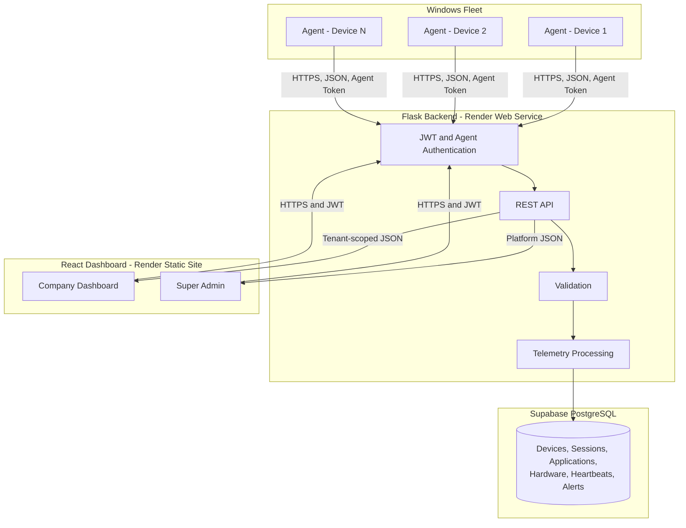

<div align="center">


# Asset Sentinel

### Continuous visibility from the endpoint to the fleet

Asset Sentinel turns Windows session, application, hardware, and heartbeat events into a live operational picture—so teams can act on what is true now, not what an inventory sheet remembered.

<br/>

<a href="https://assetsentinel.onrender.com/demo"></a>
<a href="https://github.com/Sarthaksulkhlan/Asset-Sentinel"></a>
<a href="LICENSE"></a>

**Website:** [https://assetsentinel.onrender.com](https://assetsentinel.onrender.com)

<br/><br/>

<a href="https://www.microsoft.com/windows"></a>
<a href="https://www.python.org/"></a>
<a href="https://flask.palletsprojects.com/"></a>
<a href="https://react.dev/"></a>
<a href="https://www.typescriptlang.org/"></a>
<a href="https://supabase.com/"></a>
<a href="https://render.com/"></a>

</div>

> **Production status:** Windows Agent → Flask API → Supabase PostgreSQL → React dashboard is deployed end to end. The optional AI Audit currently exists only in the Express runtime and is not exposed by the static Render frontend deployment.

## Explore

[Why Asset Sentinel](#why-asset-sentinel) · [Features](#key-features) · [Architecture](#system-architecture) · [Quick Start](#quick-start) · [Configuration](#configuration) · [Security](#security) · [Roadmap](#roadmap)

## At a Glance

| | Description |
|---|---|
| **What** | A Windows endpoint monitoring and asset-intelligence platform built around continuous agent telemetry rather than periodic fleet scans. |
| **Why it is different** | Verified Windows events and frequent collectors report endpoint state close to when it changes instead of waiting for the next inventory cycle. |
| **Who it is for** | IT operations, endpoint security, support teams, and organization administrators responsible for Windows fleets. |
| **Current coverage** | Heartbeat, hardware inventory, login/logout and lock/unlock state, active applications, usage aggregation, idle time, and productivity analytics. |
| **Trust spine** | Agent → authenticated backend → PostgreSQL → dashboard. The backend validates and persists telemetry; agents and the dashboard never write directly to the database. |
| **The moat** | A unified evidence pipeline whose per-device history becomes more valuable as session, application, hardware, and liveness records accumulate. |
| **Built with** | Python Windows Agent, Flask/Gunicorn API, Supabase PostgreSQL, and a React/TypeScript/Vite dashboard deployed on Render. |

> [Open the live demo](https://assetsentinel.onrender.com/demo) to explore Asset Sentinel with demonstration data.

## The Problem

Enterprise IT teams are expected to answer a deceptively simple question at any moment: **what is the current state of every endpoint in the fleet?** In many organizations, they cannot answer without consulting several tools and manually correlating their results.

Periodic inventories begin aging as soon as they are produced. RAM is upgraded, storage is replaced, a laptop disappears from the network, or a user locks and resumes a session—but those facts may remain buried until another scan or investigation. Responders lose time establishing whether a machine is online, who used it, which application was active, and what changed before an issue surfaced.

Hardware records, Windows session events, application activity, monitoring, and support workflows commonly live in disconnected systems. That creates an operating model based on stale snapshots and reactive reconstruction. Asset Sentinel replaces that gap with one continuously updated evidence pipeline and a fleet view grounded in endpoint records.

<div align="center">


<sub><em>Periodic inventory leaves hardware changes, missed heartbeats, and session activity hidden. Asset Sentinel turns those gaps into live, attributable signals.</em></sub>

</div>

## Why Asset Sentinel

| Traditional fleet visibility | Asset Sentinel |
|---|---|
| Periodic scans on a fixed schedule | Continuous agent reporting and verified Windows events |
| Inventory snapshots age between scans | Endpoint records are refreshed throughout operation |
| Availability inferred from an old scan | Explicit heartbeat determines online/offline state |
| Hardware changes discovered during a later audit | Hardware identity is recorded and compared over time |
| Session and usage data scattered across local logs | Login, lock/unlock, idle, and application activity are centralized per device |
| Multiple tools require manual correlation | One backend pipeline supports monitoring, alerts, reports, and support workflows |
| Fleet totals hide their underlying evidence | Operators can drill from fleet state into device-level history |

This is an architectural distinction, not a cosmetic one: a scan describes what was observed at scan time, while continuous telemetry builds a trace of what happened between observations.

## Key Features

| Category | Capability |
|---|---|
| Endpoint Monitoring | Agents report device state continuously through authenticated backend telemetry. |
| Heartbeat | Configurable liveness signals allow the backend to distinguish online, offline, and unresponsive devices. |
| Device Inventory | Structured endpoint identity and status records remain connected to ongoing telemetry. |
| Hardware Integrity | WMI-backed hardware details and identifiers provide a baseline for detecting configuration changes. |
| Login and Logout Activity | Genuine Windows authentication and session-end records provide a per-device access history. |
| Lock and Unlock Detection | Verified workstation transitions separate active use from locked sessions without creating heartbeat-based logins. |
| Active Application Timeline | Foreground application changes form a chronological activity record for each endpoint. |
| Application Usage | Application records are aggregated into open, active, and idle duration views. |
| Productivity Analytics | Active, idle, and locked time is summarized into higher-level usage insights. |
| Idle Tracking | User inactivity is measured separately from application-open time and device uptime. |
| Fleet Overview | Device telemetry is aggregated into a current organization-wide operational view. |
| Device Monitoring | Administrators can drill into hardware, connectivity, sessions, and activity history for one endpoint. |
| Alerts and Reports | Telemetry conditions are surfaced for review and consolidated reporting. |
| Support Tickets | Endpoint-related issues can be tracked alongside the operational context that informs them. |
| Super Admin | Platform-level controls manage companies, administrators, devices, and support state. |

## From Endpoint Evidence to Fleet Intelligence

<div align="center">


<sub><em>Session, application, hardware, and heartbeat evidence is authenticated and normalized before it becomes fleet health, timelines, usage insight, and actionable integrity alerts.</em></sub>

</div>

## System Architecture



The agent never connects directly to the database, and the dashboard never connects directly to monitored devices. Telemetry passes through the backend API for authentication, validation, processing, and persistence.

### Architecture principles

- **Separate trust channels:** Windows agents use a dedicated bearer token; dashboard users use JWT access and refresh tokens.
- **Tenant-aware access:** company users are scoped to their organization, while platform-wide operations require the `SUPER_ADMIN` role.
- **Evidence before analytics:** raw session, application, heartbeat, and hardware observations are normalized before they become timelines, alerts, and usage insights.
- **Database as source of truth:** PostgreSQL holds operational state and history; the agent and dashboard never write to it directly.
- **Deployment-aware design:** Render hosts the React application as a static site and the Flask API as a separate Gunicorn service.

## How It Works

1. The Windows agent runs continuously on each managed endpoint.
2. It detects session state, foreground applications, hardware information, and device health.
3. Timestamped telemetry is sent securely to the backend API.
4. The backend validates and stores records in Supabase PostgreSQL.
5. The React dashboard retrieves current and aggregated fleet information from the API.


## Technology Stack

| Layer | Technology | Responsibility |
|---|---|---|
| Windows Agent | Python, pywin32, WMI, psutil | Hardware, session, heartbeat, foreground application, and usage collection |
| Backend API | Python, Flask, Flask-CORS | Authentication, validation, tenant isolation, telemetry ingestion, and analytics |
| Data Access | SQLAlchemy 2, psycopg2 | PostgreSQL models, constraints, transactions, and queries |
| Authentication | PyJWT, bcrypt | Access/refresh tokens, password hashing, role checks, and password-reset OTPs |
| Database | Supabase PostgreSQL | Operational state and historical evidence |
| Frontend | React 19, TypeScript, Vite, Tailwind CSS | Dashboard, administration, support, and responsive user experience |
| Deployment | Render Static Site, Render Web Service, Gunicorn | Production hosting and process management |
| Transport | HTTPS and JSON | Agent-to-API and browser-to-API communication |

## Repository Structure

```text
asset-sentinel/
├── agent/
│   ├── collectors/       Session, heartbeat, hardware, and application collectors
│   ├── detectors/        Hardware change detectors
│   ├── scripts/          Agent and service management scripts
│   └── windows/          Windows Service implementation
├── backend/
│   ├── api/              Flask API routes
│   ├── core/             Configuration, database, storage, and health
│   ├── models/           SQLAlchemy models
│   └── services/         Backend services
├── database/
│   ├── migrations/       Database migrations
│   └── schemas/          PostgreSQL schema
├── frontend/             React and Vite dashboard
├── docs/                 Architecture, setup, and installation documentation
├── tools/                Migration and verification utilities
├── app.py                Backend launcher and Gunicorn application export
└── requirements.txt      Python dependencies
```

## Windows Monitoring Agent

The Python agent runs on monitored Windows endpoints as either the installed Windows Service or an interactive console process. It combines verified native session notifications with scheduled heartbeat, hardware, and foreground-application collectors. Telemetry is authenticated and sent only to the backend API; the agent does not connect to PostgreSQL directly.

The service path handles genuine Windows session changes through the Service Control Manager. Interactive runs register a native Windows session hook for real unlock notifications, keeping login creation separate from heartbeat, foreground-application changes, timers, and dashboard refreshes.

## Quick Start

### Prerequisites

- Python 3.10 or newer
- Node.js 20 or newer and npm
- A PostgreSQL database
- Windows for endpoint collectors and Windows Service operation

### 1. Configure the environment

Copy `.env.example` to `.env` for local development and configure the required values. Production secrets must be set through Render environment variables and must never be committed.

```powershell
Copy-Item .env.example .env
```

### 2. Install backend dependencies


```powershell
python -m pip install -r requirements.txt
```

### 3. Prepare the database

Apply the base schema and migrations described in [docs/SETUP.md](docs/SETUP.md).

### 4. Run locally

Backend:

```powershell
python app.py
```

Frontend:

```powershell
cd frontend
npm install
npm run dev
```

Manual Windows agent:

```powershell
python agent/collectors/monitoring_agent.py --console
```

## Configuration

| Variable | Used by | Purpose |
|---|---|---|
| `ASSET_SENTINEL_DATABASE_URL` | Backend | PostgreSQL connection string |
| `ASSET_SENTINEL_JWT_SECRET` | Backend | Signs and validates user tokens |
| `ASSET_SENTINEL_AGENT_TOKEN` | Backend and agent | Authenticates endpoint telemetry |
| `ASSET_SENTINEL_API_URL` | Windows agent | Base URL of the Flask API |
| `VITE_API_BASE_URL` | Frontend | Base URL used for browser API requests |
| `ASSET_SENTINEL_CORS_ORIGINS` | Backend | Comma-separated allowed frontend origins |
| `SUPER_ADMIN_USERNAME`, `SUPER_ADMIN_EMAIL`, `SUPER_ADMIN_PASSWORD` | Backend | Bootstrap platform administrator |
| `SMTP_*`, `ALERT_EMAIL` | Backend | OTP, alert, and support email delivery |

Additional retry, timeout, spool, and collector settings are documented in [.env.example](.env.example).

> **Important:** the source includes a development fallback agent token for local convenience. Always configure a strong, unique `ASSET_SENTINEL_AGENT_TOKEN` outside local development.

## Windows Service

Run the installation command from an elevated Windows Command Prompt or PowerShell:

```bat
install_service.bat
```

Service controls:

```bat
start_service.bat
stop_service.bat
restart_service.bat
uninstall_service.bat
```

## Security

- Agent-to-backend and frontend-to-backend traffic uses HTTPS in production.
- Secrets are supplied through environment variables.
- Agent telemetry uses a dedicated bearer token with configurable request timeout and retry behavior.
- User passwords are hashed with bcrypt.
- Dashboard sessions use signed access tokens and database-backed, revocable refresh tokens.
- Password-reset OTPs are hashed, expire, count failed attempts, and are single-use.
- Company data is tenant-scoped; platform operations require the `SUPER_ADMIN` role.
- Administrative functions are restricted by role and company status.

For production deployments, rotate all sample credentials, restrict diagnostic endpoints, configure exact CORS origins, and define retention rules for session and application history. See [SECURITY.md](SECURITY.md) for the disclosure policy.

## Current Limitations

| Feature | Status | Notes |
|---|---|---|
| Agent telemetry pipeline | Operational | Hardware, heartbeat, sessions, applications, usage, alerts, and changes |
| Company and super-admin dashboards | Operational | Tenant-aware monitoring, support, and platform administration |
| Email and password-reset delivery | Configuration-dependent | Requires valid SMTP settings |
| AI Audit | Experimental | Implemented in `frontend/server.ts`; unavailable through the current static Render frontend |
| Formal OpenAPI specification | Planned | Routes are currently documented in source and project documentation |
| Automated exports and retention controls | Planned | Not yet exposed as complete workflows |

## Roadmap

- [ ] Move AI Audit behind a production API or deploy the Express runtime explicitly
- [ ] Expand automated report exports
- [ ] Add more granular role-based permissions
- [ ] Publish formal OpenAPI documentation
- [ ] Add configurable historical data-retention policies
- [ ] Add automated contract tests for tenant isolation, token lifecycle, and telemetry deduplication

## Documentation

- [Architecture](docs/ARCHITECTURE.md)
- [Installation](docs/INSTALLATION.md)
- [Setup](docs/SETUP.md)
- [Screenshot guidance](docs/screenshots/README.md)
- [Security policy](SECURITY.md)
- [MIT license](LICENSE)

## Contributing

Keep agent payloads, backend models, database migrations, and frontend types aligned. Before submitting a change:

1. Run `npm run lint` from `frontend/`.
2. Run the relevant checks under `tools/verification/`.
3. Document new environment variables, routes, migrations, and operational behavior.
4. Never commit `.env`, credentials, access tokens, database URLs, or sensitive endpoint telemetry.
